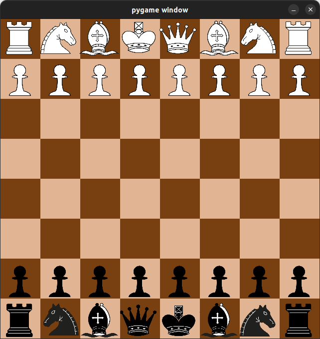

# RLchess
This project aims to create a complete chess game with an GUI which will also contain a
Reinforcement Learning (RL) bot.

# Installing the game
First start by cloning this repository:
```shell
git clone https://github.com/sachahu1/RLchess && cd RLchess
```

## Installing poetry
This game uses poetry as a dependency manager. To learn more about poetry,
please head to [the poetry page](https://python-poetry.org/).

## Installing the package
Once poetry is installed, installing the package becomes very simple.

Simply run:
```shell
poetry install
```
You're done ! You can now start using the package.

# Running the game
At this time, the game is not yet fully functional. However, you can already launch
the GUI by running:
```shell
RLchess
```
This will run an interface looking like this:


